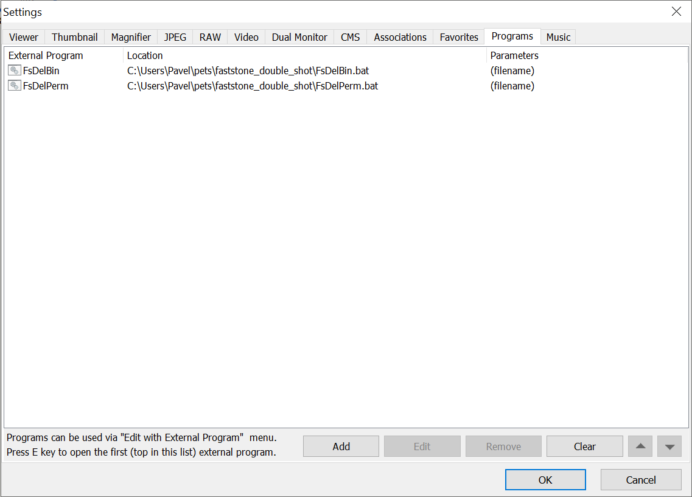
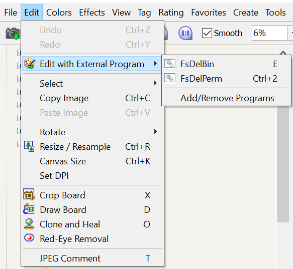

# FastStone Double Shot

Delete paired JPG and RAW files together from FastStone Image Viewer with a single shortcut.

When shooting in RAW+JPG mode, deleting a JPG in FastStone leaves the RAW file behind (and vice versa). FastStone Double Shot finds all files sharing the same base name — across JPG, CR2, CR3, NEF, ARW, RAF, ORF, RW2, DNG — and deletes them together.

It comes in two interchangeable flavours: ready-to-use **PowerShell scripts** (no build step) and standalone **Rust executables** (no console flash, no PowerShell). Pick whichever suits you — they configure into FastStone the same way and behave the same.

## Features

- **Two deletion modes** — Recycle Bin (silent for pairs, confirmation for 3+ matches) and Permanent (always confirms)
- **Multi-format support** — works with all major camera RAW formats
- **Safe by design** — confirmation dialog for bulk or permanent operations; Recycle Bin delete is recoverable

## Supported Formats

| Format | Extensions | Cameras |
|--------|-----------|---------|
| JPEG | `.jpg` `.jpeg` | All |
| Canon RAW | `.cr2` `.cr3` | Canon EOS |
| Nikon RAW | `.nef` | Nikon Z / D series |
| Sony RAW | `.arw` | Sony Alpha |
| Fujifilm RAW | `.raf` | Fujifilm X / GFX |
| Olympus RAW | `.orf` | OM System / Olympus |
| Panasonic RAW | `.rw2` | Panasonic Lumix |
| Adobe DNG | `.dng` | Various (converted or native) |

## Which version should I use?

| | PowerShell scripts | Rust executables |
|--|--------------------|------------------|
| **Setup** | Download and go — no build | Build once with Rust (or use a prebuilt copy) |
| **You point FastStone at** | `FsDelBin.bat` / `FsDelPerm.bat` | `FsDelBin.exe` / `FsDelPerm.exe` |
| **Console window** | A black CMD window flashes briefly each run | None — the exes run windowless |
| **Dependencies** | PowerShell 5.1+ (built into Windows 10/11) | None (statically linked, self-contained) |
| **Changing the format list** | Edit `FsDeleteJpgRaw.ps1`, no rebuild | Edit `src/matching.rs`, then rebuild |

Both deliver the same deletion modes, the same confirmation thresholds, the same matching behaviour (including doing nothing when the selected file isn't a supported type), and the same `(filename)` FastStone setup. The Rust build additionally runs windowless (no CMD flash) and needs no PowerShell.

---

## Version A — PowerShell scripts

### 1. Download the scripts

Place the three script files together in a folder, for example:

```
C:\Tools\FastStoneDoubleShot\
  FsDeleteJpgRaw.ps1
  FsDelBin.bat
  FsDelPerm.bat
```

`FsDelBin.bat` and `FsDelPerm.bat` are thin wrappers that call `FsDeleteJpgRaw.ps1` with the right mode.

### 2. Configure FastStone (see [Shared FastStone setup](#shared-faststone-setup))

Point the two program slots at `FsDelBin.bat` and `FsDelPerm.bat`.

### Changing formats

Edit the `$Extensions` array in `FsDeleteJpgRaw.ps1`:

```powershell
$Extensions = @(
    ".jpg", ".jpeg",
    ".cr2", ".cr3",   # Canon
    ".nef",            # Nikon
    ".arw",            # Sony
    ".raf",            # Fujifilm
    ".orf",            # Olympus
    ".rw2",            # Panasonic
    ".dng"             # Adobe DNG
)
```

Add any extension in lowercase with a leading dot. Remove lines you don't need.

---

## Version B — Rust executables

### 1. Build

With the Rust toolchain installed ([rustup](https://rustup.rs/)), from the project root:

```powershell
cargo build --release
```

This produces two self-contained executables in `target\release\`:

```
target\release\FsDelBin.exe    # delete to Recycle Bin
target\release\FsDelPerm.exe   # delete permanently
```

They link the C runtime statically and depend only on system DLLs, so they run on any Windows 10 or later machine without installing anything else. Copy them wherever you like, e.g. `C:\Tools\FastStoneDoubleShot\`.

### 2. Configure FastStone (see [Shared FastStone setup](#shared-faststone-setup))

Point the two program slots at `FsDelBin.exe` and `FsDelPerm.exe`.

### Changing formats

Edit the `SUPPORTED_EXTENSIONS` list in [`src/matching.rs`](src/matching.rs) (lowercase, no leading dot) and run `cargo build --release` again.

---

## Shared FastStone setup

Open FastStone Image Viewer and go to **Settings > Programs** (or press the **Configure Programs** button on the toolbar).

Click **Add** to create two program slots pointing to the two files for your chosen version, with `(filename)` as the parameter:



The first program in the list gets the **E** shortcut key. Additional programs are available via **Ctrl+2**, **Ctrl+3**, etc.

Then go to **Edit > Edit with External Program** and select the desired action, or use the keyboard shortcut directly:



| Action | Points at | Default Shortcut |
|--------|-----------|-----------------|
| Delete to Recycle Bin | `FsDelBin.bat` / `FsDelBin.exe` | `E` |
| Delete Permanently | `FsDelPerm.bat` / `FsDelPerm.exe` | `Ctrl+2` |

## Usage

### Delete to Recycle Bin

- **1–2 files** with the same base name: deleted silently to the Recycle Bin
- **3+ files** with the same base name: a confirmation dialog lists all files before deleting

### Delete Permanently

- **Always** shows a confirmation dialog listing all files, regardless of count
- Files are permanently removed (not recoverable)

If any file cannot be deleted (for example, it is open in another program), an error dialog lists the files that were left behind; the rest are still deleted.

## How It Works

1. FastStone passes the selected file path to the chosen program.
2. The program scans the file's directory for all files with the same base name and a supported extension (compared case-insensitively).
3. Depending on the mode and file count, it either deletes silently or shows a confirmation dialog.
4. Files are sent to the Recycle Bin or permanently removed.

The PowerShell version does this with `Get-ChildItem` and the VisualBasic `FileSystem.DeleteFile` API; the Rust version uses a directory scan and the Win32 `SHFileOperationW` call. The matching rules are the same.

## Project Layout (Rust version)

| Path | Purpose |
|------|---------|
| `src/matching.rs` | Finds files sharing a base name; the supported-format list |
| `src/mode.rs` | Deletion mode and when confirmation is required |
| `src/message.rs` | Text for the confirmation and error dialogs |
| `src/windows_os.rs` | Win32 boundary: dialogs and deletion |
| `src/lib.rs` | Orchestration (`run`) and the command-line entry point |
| `src/del_bin.rs`, `src/del_perm.rs` | The two binaries |

See [TESTING.md](TESTING.md) for the automated (`cargo test`) and manual test procedures.

## Requirements

- **To run either version:** Windows 10 or later
- **Version A:** PowerShell 5.1+ (included with Windows 10/11)
- **Version B (to build):** the Rust toolchain ([rustup](https://rustup.rs/))
- [FastStone Image Viewer](https://www.faststone.org/FSViewerDetail.htm)

## License

MIT
